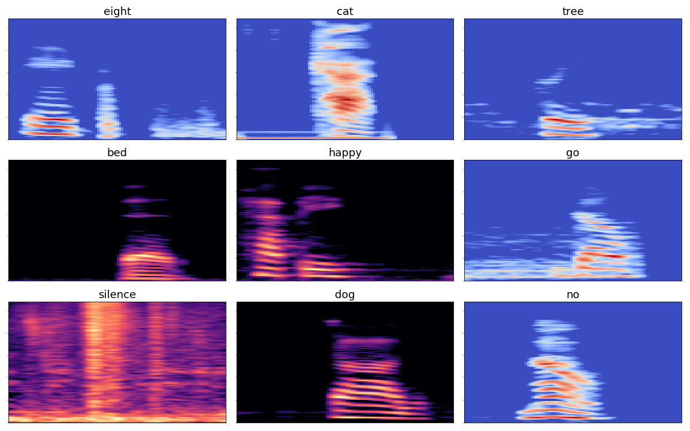
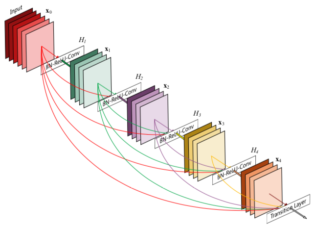

# TensorFlow Speech Recognition Challenge

<p align="center">

</p>
[*Can you build an algorithm that understands simple speech commands?*](https://www.kaggle.com/c/tensorflow-speech-recognition-challenge) 

In this competition, you're challenged to use the Speech Commands Dataset to build an algorithm that understands simple spoken commands. By improving the recognition accuracy of open-sourced voice interface tools, we can improve product effectiveness and their accessibility.


## Team 

* **Team Name**: 그데목 (Geudemog)
* **Team Member**: [DaMach0](https://github.com/DaMacho), [Nhol](https://github.com/Nhol), [kjw1oo](https://github.com/kjw1oo), [yanggyu17](https://github.com/yanggyu17)


## Model

* Model1: [Densely Connected Convolutional Networks](https://arxiv.org/abs/1608.06993) 모델(DenseNet-121) `DenseNet()`

  <p align="center">
  
  </p>

* Model2: CNN과 LSTM을 결합한 모델 `CnnLstm()`


## Preprocessing

Example:

```
$ python preprocessing.py --data_path "data"
```

Optional arguments:

```
$ python preprocessing.py -h

optional arguments:
  -h, --help            show this help message and exit
  --data_path DATA_PATH
  --tfr_fname TFR_FNAME
                        file name of TFRecord to be created (default:
                        train.tfrecord)
  --train               use training data (default: False)
```


## Train

Example:

* Train CNN+LSTM model

* ``````
  $ python train.py
  ``````

* Train DenseNet model

  ```
  $ python train.py --densenet
  ```

Optional arguments:

```
$ python train.py -h

optional arguments:
  -h, --help            show this help message and exit
  --tfr_fname TFR_FNAME
                        file name of TFRecord to train (default:
                        train.tfrecord)
  --logdir LOGDIR       directory name where to write log files (default:
                        logs)
  --save_fname SAVE_FNAME
                        prefix of model to be saved (default: model
  --num_epochs NUM_EPOCHS
                        number of training epochs (defalut: 5)
  --densenet            train DenseNet model (default: False)
```


## Predict

Example:

```
$ python predict.py --model_fname "your_model"
```

Optional arguments:

```
$ python predict.py -h

optional arguments:
  -h, --help            show this help message and exit
  --model_fname MODEL_FNAME
                        file name of saved model to use
  --tfr_fname TFR_FNAME
                        TFRecord file name where the data to predict is stored
                        (default: test.tfrecord)
  --sample_fname SAMPLE_FNAME
                        Kaggle sample submission file name (default:
                        sample_submission.csv)
  --output_fname OUTPUT_FNAME
                        output file name (default: submission.csv)
  --densenet            use DenseNet model (default: False)
  --proba               predict probabilities (default: False)
```


## Result

* Test accuracy : **0.87828**
* Leaderboard position : **132**/1315
